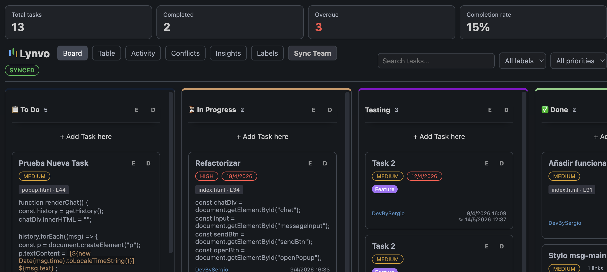

# Lynvo - Project Board

Lynvo turns VS Code into a local-first project board for engineering teams. It combines a Kanban workflow, code-linked tasks, GitHub-backed collaboration, and project views directly inside the editor.



## Key Features

- **Kanban board:** Dynamic columns, drag and drop, priorities, due dates, labels, filters, and search.
- **Table view:** Jira-style task overview for scanning status, priority, labels, due dates, and linked code.
- **Code-linked tasks:** Create tasks from selected code and jump back to the exact file and lines from the board.
- **Checklists and task relations:** Break down work into checklist items and connect tasks as related, blocking, blocked by, or duplicates.
- **Activity feed:** Track board changes, task edits, checklist updates, relation changes, and deletes.
- **Markdown descriptions:** Supports lists, checklists, links, quotes, inline code, and fenced code blocks.
- **Conflict center:** Review basic sync conflicts and choose the local or remote value.
- **Local-first persistence:** Project data lives in `.vscode/lynvo/` using modular JSON files by entity.
- **Shadow Branch Sync:** Automatic GitHub sync writes technical commits only to the internal `lynvo-sync` branch, keeping `main`, `develop`, and feature branches clean.
- **Presence indicators:** Shows recently active collaborators based on local sync metadata.

## Data Model

Lynvo stores board data in a modular project folder:

```text
.vscode/lynvo/
  board.json
  columns.json
  users.json
  settings.json
  tasks/
    task-id.json
  activity/
    activity-id.json
  metadata/
    sync.json
    tombstones.json
    conflicts.json
    version.json
```

Existing projects using `.vscode/lynvo.json` are migrated automatically the first time Lynvo loads the board.

## Team Sync

Lynvo syncs through Git and the repository remote named `origin`.

- Automatic commits are isolated in the internal `lynvo-sync` branch.
- The active user branch is not checked out, amended, or polluted with technical commits.
- Local board changes are debounced before sync to reduce unnecessary Git operations.
- Offline or failed pushes keep changes locally and retry on the next sync.
- Deletes are tracked with tombstones to reduce task resurrection during merges.
- Basic field conflicts are surfaced in the Conflict Center.

## Getting Started

1. Open a workspace that is already a Git repository.
2. Configure a remote named `origin` if you want team sync.
3. Run `Lynvo: Open Project Board` from the command palette or open Lynvo from the Activity Bar.
4. Create columns, labels, and tasks from the board or from selected code.
5. Use `Lynvo: Sync Team Board` to trigger sync manually; Lynvo also performs background sync.

## Commands

| Command | Description |
| :-- | :-- |
| `Lynvo: Open Project Board` | Opens the Kanban board. |
| `Lynvo: Open Table View` | Opens the table view. |
| `Lynvo: Open Activity Feed` | Opens the activity feed. |
| `Lynvo: Open Conflict Center` | Opens sync conflict resolution. |
| `Lynvo: Open Labels Manager` | Opens label management. |
| `Lynvo: Open Insights View` | Opens project analytics. |
| `Lynvo: Quick Create Task` | Creates a task from VS Code without opening the board first. |
| `Lynvo: Create Task from Selection` | Creates a task linked to selected code. |
| `Lynvo: Sync Team Board` | Runs a manual shadow-branch sync. |
| `Lynvo: Connect GitHub` | Stores the current GitHub identity for task authorship and presence. |

## Requirements

- Visual Studio Code 1.80.0 or newer.
- Git installed locally.
- A repository remote named `origin` for GitHub-backed collaboration.

## Privacy

Lynvo has no external application server. Board data is stored in the current workspace and synchronized through your Git remote when sync is enabled.

## Development

```bash
npm install
npm run compile
npm run package
npm run compile-tests
```

## License

MIT
