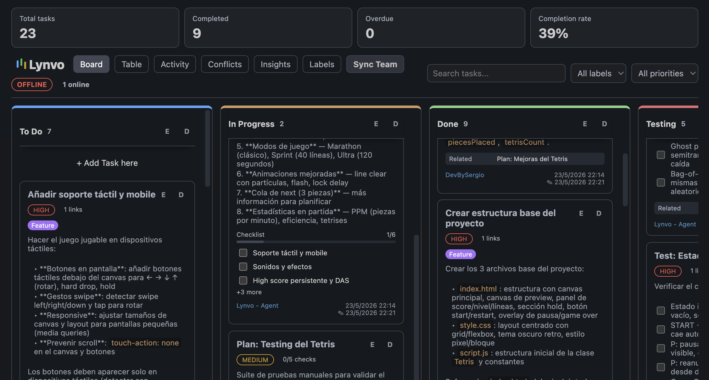
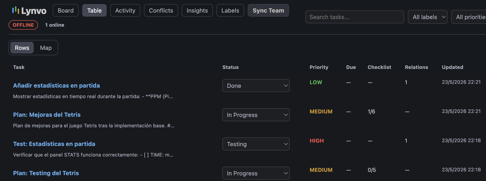

# Lynvo — Project Board 🗂️

**Lynvo** turns VS Code into a local-first Kanban board for engineering teams. It combines drag-and-drop project management, code-linked tasks, Git-backed collaboration, and AI agent integration — all inside your editor.

Unlike other project management tools, **your data stays in your workspace**. No servers, no sign-ups, no vendor lock-in.

---

## ✨ Key Features

### 1. 🎯 Full Kanban Workflow

Manage your entire project without leaving VS Code:

- **Dynamic columns** with drag-and-drop reordering
- **Priorities** (high / medium / low) with color-coded badges
- **Labels** — create, edit, and filter by custom tags
- **Due dates** with automatic overdue / soon / future state indicators
- **Checklists** inside tasks with real-time toggling
- **Task relations** — link tasks as related, blocking, blocked by, or duplicates
- **Markdown descriptions** with full syntax support (lists, code blocks, links, quotes)

### 2. 📊 Multiple Project Views

Six interconnected views to match how you work:

- **Board** — Classic Kanban with inline editing, search, and filters
- **Table** — Spreadsheet-like overview with sortable columns and a node-graph map mode
- **Activity** — Chronological feed of every board change
- **Insights** — Project metrics: total tasks, completion rate, overdue, stale, and in-progress counts
- **Conflicts** — Visual diff resolution for sync field conflicts
- **Labels** — Centralized label creation and deletion

### 3. 🤖 AI Agent Integration

Lynvo is designed to work **with AI coding agents** (OpenCode, Claude Code, Cline, Cursor, and others). When Lynvo is installed, agents can read, create, and update tasks autonomously:

- **Planning-first workflow** — Agents create a parent task with a checklist before starting multi-step work, then mark items complete as they progress
- **Direct JSON access** — Board data is stored as individual JSON files in `.vscode/lynvo/`, so agents can operate on tasks without any API
- **Real-time visibility** — Checklist toggles, status moves, and activity entries are written by agents in real time, visible instantly on the board
- **Autonomous task management** — Agents can create implementation tasks with labels, priorities, due dates, code references, and relations
- **File watcher** — Any direct file edit by an agent is picked up by the extension within ~250ms and the webview refreshes automatically
- **SKILL.md included** — A complete agent integration skill is bundled with the extension, providing full type definitions, ID generation, and workflow guidance

> **Note for AI agents:** If Lynvo is installed in the workspace, check for `.vscode/lynvo/` and use the SKILL.md instructions to manage tasks on the board.

### 4. 👨‍👩‍👧‍👦 Team Sync via Git

Collaborate without a central server:

- **Shadow-branch pattern** — All sync happens on a dedicated `lynvo-sync` branch, never touching `main` or feature branches
- **Automatic sync** — Background sync every 120 seconds, plus a 15-second debounce after changes
- **Conflict resolution** — Field-level conflicts are detected and surfaced in the Conflict Center UI
- **Tombstone tracking** — Deleted entities are tracked to prevent resurrection during merges
- **Presence indicators** — See who else is working on the board based on sync metadata
- **Manual sync** — Trigger on demand with `Lynvo: Sync Team Board`

### 5. 🔒 Local-First & Private

- **Zero external servers** — All data lives in `.vscode/lynvo/` inside your workspace
- **Modular JSON files** — Tasks, columns, labels, activity, and metadata are stored as separate files for easy inspection and direct editing
- **Atomic writes & corruption recovery** — Files are written to temp files first, then renamed; corrupt files are backed up automatically
- **Offline-first** — Work without internet; changes sync when the remote is reachable again

### 6. 🔗 Code-Integrated Tasks

- **Create tasks from code** — Select code in the editor and run `Lynvo: Create Task from Selection` to capture the exact file and line range
- **Code references on cards** — Every task shows linked file paths with one-click navigation back to the source
- **Open code from the board** — Click any code reference to jump directly to the file and line

---

## 🚀 How to Use

Once installed, Lynvo appears in the Activity Bar. Open the Command Palette (`Ctrl+Shift+P` or `Cmd+Shift+P`) and use any of these commands:

| Command                             | Description                                             |
| :---------------------------------- | :------------------------------------------------------ |
| `Lynvo: Open Project Board`         | Opens the Kanban board                                  |
| `Lynvo: Open Table View`            | Opens the table / map view                              |
| `Lynvo: Open Activity Feed`         | Opens the chronological activity feed                   |
| `Lynvo: Open Conflict Center`       | Opens sync conflict resolution                          |
| `Lynvo: Open Labels Manager`        | Opens label management                                  |
| `Lynvo: Open Insights View`         | Opens project analytics                                 |
| `Lynvo: Quick Create Task`          | Creates a task without opening the board                |
| `Lynvo: Promote Selection To Task`  | Creates a task linked to selected code                  |
| `Lynvo: Sync Team Board`            | Runs a manual Shadow-branch sync                        |
| `Lynvo: Connect GitHub`             | Stores your GitHub identity for authorship and presence |

---

## 📸 Screenshots

_Board View_

_Table View_

---

## 🛡️ Privacy Policy

Your data is yours.

- **No Telemetry:** Lynvo does **NOT** send any data to external servers.
- **Local Storage:** All board data is stored as JSON files in `.vscode/lynvo/` within your workspace.
- **Git Sync:** If you enable team sync, data is pushed to your configured Git remote, but Lynvo has no application backend.
- **No Account Required:** You can use the full board without any authentication; GitHub identity is optional and used only for authorship attribution.

---

## 📝 License

This project is licensed under the [MIT License](LICENSE).

---

**Happy building!** 🚀
